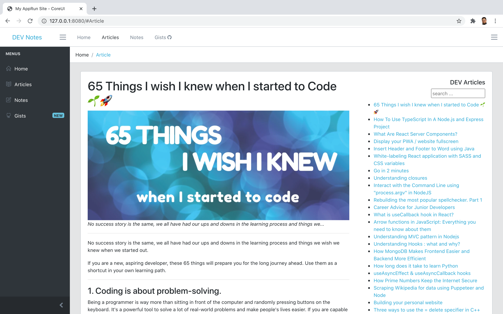
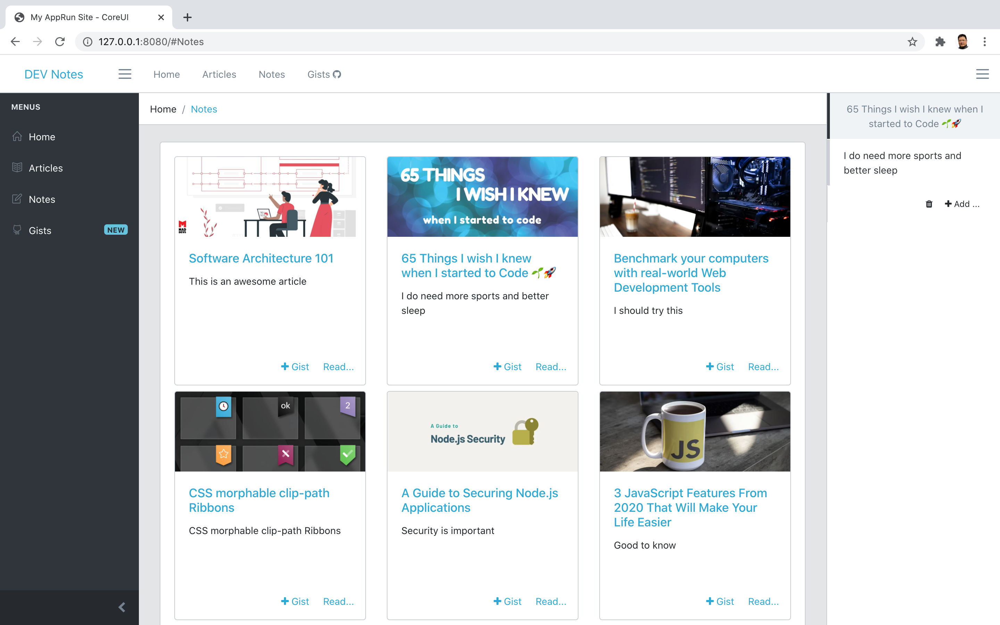
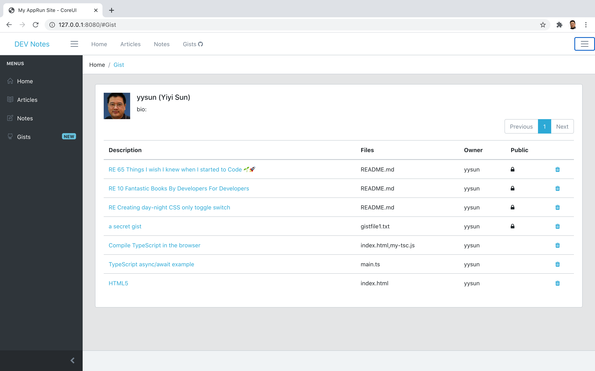

# AppRun Course 2021 - WIP

## About AppRun

[AppRun](https://github.com/yysun/apprun) is an open-source JavaScript library that is small but powerful. AppRun is not well known by the developer community yet. However, developers like it once they learn about it. Apress published a book about it when the editor found it.

## About this Course

The target audience of this course is beginner web developers who are interested in building high-performance frontend applications. This course is also for students who already have some knowledge of other modern JavaScript frameworks such as React, Angular, Vue, and are looking for a lightweight alternative.

This course is not an ordinary coding course that shows some hello-world like toy apps. It has a practice project to mimic real business applications aiming to bring web developers to a professional level.

1. A single page App that has a professional user interface
2. Back-end data access through REST API and GraphQL
3. Manage security through OAuth using Github/Gists as an example

## What you will learn

### Module 1: What is AppRun

* Why another JavaScript library, AppRun?
* Get a taste of AppRun with almost no effort.
* What’s the benefit of using AppRun?

### Module 2: Start An App Project

* How to create a project
* How to use a development server
* How to add pages
* How to manage pages by using modules
* How to build for production
* How to optimize the bundle

### Module 3: Make a Beautiful App App

* How to define site settings: site name, navigations, and sidebar
* How to make a dynamic layout
* How to change the theme – apply a professional design
* How to use JSX for the view
* How to use the routing events
* How to create custom directives
* How to integrate with other libraries, D3 as an example

### Module 4: Make a Data-Driven App

* How to communicate between components
* How to bind user inputs to multiple components
* How to make a modal
* How to confirm for deletion
* How to manage authentication/authorization state
* How to authorize Github/Gist access through OAuth
* How to make a simple GraphQL query
* How to manage Gists as business objects in business apps

### Module 5: Verify and Test an App

* How to verify if the components and events
* How to add unit-tests to the project
* How to verify the test coverage
* How to create unit tests
* How to mock API
* How to create snapshot tests

## Use Source Code of the Project

* Run _npm install_ to install the packages
* Run npm scripts to launch the project of each lesson

Or

* Enter each chapter / lessons
* Run _ln_ or _mklink_ to make symlinks to the node_modules directory
* Run npm scripts to launch the project of each lesson

(C) Copyright 2021, Yiyi Sun
